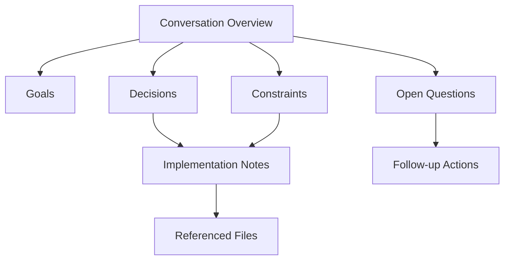
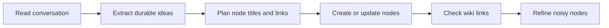
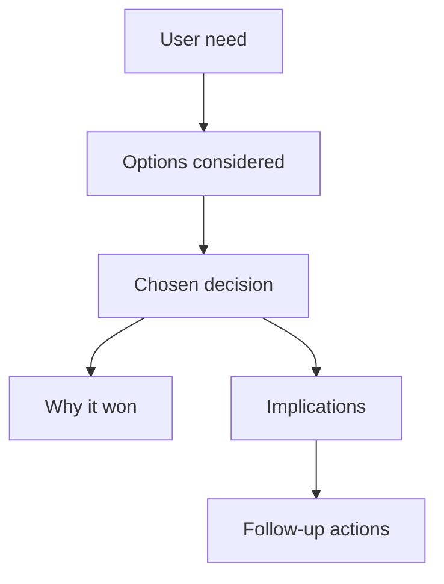

# Conversation Node Summarizer

Convert conversation history into a useful node graph: many small, linked Markdown files in `nodes/`, created and maintained with the repository scripts in `./scripts`.

The goal is not to make a pretty transcript. The goal is to preserve reusable understanding: what was decided, why it matters, what constraints shaped it, what actions remain, and how concepts connect.

## Repository Tools

Use these scripts from the repository root:

| Purpose | Script | npm alias |
| --- | --- | --- |
| Add a new node | `./scripts/add-node.sh` | `npm run node:add --` |
| Replace a node body while preserving its title | `./scripts/edit-node-content.sh` | `npm run node:edit --` |
| Read a node | `./scripts/get-node-content.sh` | `npm run node:get --` |
| Search titles | `./scripts/search-nodes-by-title.sh` | `npm run node:search:title --` |
| Search bodies | `./scripts/search-nodes-by-content.sh` | `npm run node:search:content --` |
| Verify `[[Wiki Links]]` resolve | `./scripts/check-node-links.sh` | `npm run node:check-links` |

## Node Graph Shape

Prefer a hub-and-spoke map with cross-links. Start with one overview node, then create focused nodes for decisions, constraints, actions, artifacts, people, risks, and open questions.



Good node graphs feel browsable. A reader should be able to start anywhere, follow links, and understand the important context without reading the full conversation.

## Node Granularity

Create many nodes, but avoid atomizing into noise.

- One node per durable idea: a decision, requirement, concept, risk, workflow, or action set.
- Use 6-20 nodes for a substantial conversation; fewer for short chats, more for long transcripts.
- Keep each node body focused: usually 80-250 words or a compact checklist.
- Link to 2-6 related nodes where helpful.
- Do not create nodes for pleasantries, status chatter, terminal noise, or generic tool confirmations.

## Conversation Extraction Pass

Read the conversation and classify information into buckets before writing files:

| Bucket | What to capture | Example node title |
| --- | --- | --- |
| Overview | What the conversation accomplished | `Conversation Summary - Node Skill` |
| Goals | Desired outcome and success criteria | `Conversation Node Skill Goals` |
| Decisions | Chosen direction and rationale | `Node Summarization Decisions` |
| Constraints | Boundaries, preferences, non-goals | `Concise Agent Communication` |
| Workflow | Repeatable process | `Conversation To Node Workflow` |
| Artifacts | Files, scripts, commands, outputs | `Node Script Usage` |
| Actions | Follow-ups with owners or triggers | `Conversation Follow-up Actions` |
| Questions | Unknowns or deferred choices | `Open Questions From Conversation` |

When the conversation includes code, commands, paths, URLs, or diagrams, preserve them only when they help future work. Summarize logs; do not paste long output unless the exact output is important evidence.

## Writing Style For Nodes

Use direct, information-dense prose.

- Start with the point, not a meta sentence like "This node summarizes...".
- Prefer bullets for decisions, requirements, and actions.
- Keep titles stable and linkable: Title Case, no dates unless the node is event-specific.
- Titles must be unique. Include the project, product, customer, or workstream name when a generic title would collide, such as `Atlas Sync Decisions` instead of `Decisions`.
- Use `[[Exact Node Title]]` links. Link titles must match node headings.
- Prefer links embedded in natural sentences over a trailing `Related:` line.
- Include source hints only when useful: file paths, command names, issue IDs, URLs, or timestamps.
- Avoid filler inside node bodies: no "sent to phone", "verified with linting", "all set", "as requested", "successfully completed", or similar status phrases unless that operational event is the actual subject of the node.

## Node Noise Filter

The generated nodes are the output. Optimize the node content, not a final chat response.

- Exclude execution trivia that does not teach the future reader anything.
- Exclude tool-delivery notes such as phone notifications, screenshots sent, browser opened, or files handed off.
- Exclude verification boilerplate such as lint/build/test status unless the conversation is specifically about that verification result.
- Exclude generic assistant self-reporting such as "I created", "I updated", "done", or "as requested".
- Keep operational facts only when they change the knowledge graph: a failed command that caused a decision, a broken link that created an action, or a test result that is evidence for a technical claim.

Good node content:

```markdown
The node graph should preserve durable decisions and constraints from the conversation.

- Capture goals, decisions, actions, artifacts, and open questions as separate linked nodes.
- The [[Conversation To Node Workflow]] uses `./scripts/check-node-links.sh` because unresolved links make the graph harder to browse.
```

Poor node content:

```markdown
The assistant created the nodes successfully, verified with linting, sent the result to the phone, and completed the request.
```

## Script Workflow

1. Search before creating, to avoid duplicates.
2. Create or update nodes with the repository scripts rather than writing ad hoc files.
3. Run `check-node-links.sh` after changing linked nodes.
4. If a link is missing, create the target node or revise the link to an existing title.

### Search For Existing Nodes

```bash
./scripts/search-nodes-by-title.sh "Conversation"
./scripts/search-nodes-by-content.sh -C 5 "node graph"
```

### Verify Links

```bash
./scripts/check-node-links.sh
```

If it reports `Missing link: Source -> Target`, either create `Target` exactly or change the link to an existing title.

## Node Content Template

Use this template for most nodes:

```markdown
# Node Title

One-sentence point of the node.

- Important fact, decision, or constraint.
- Supporting detail with a source path, command, or linked concept if useful.
- Follow-up action or implication.

This connects to [[Other Node]] when readers need the broader context and to [[Another Node]] when they need the implementation details.
```

For an overview node:

```markdown
# Conversation Summary - Short Topic

The conversation centered on [goal/outcome], with emphasis on [constraints] and [artifacts].

## Main Threads

- [[Goal Node]] - why the work exists.
- [[Decision Node]] - what was decided and why.
- [[Workflow Node]] - how future agents should repeat the work.
- [[Open Questions Node]] - what remains unresolved.

## Useful Artifacts

- The scripts in `./scripts/` manage node files and verify wiki links.
- `./src/data/nodeGraph.ts` shows how titles and `[[Wiki Links]]` become graph connections.
```

## Diagram Patterns

Use Mermaid diagrams only when they clarify structure. The app renders Mermaid blocks in the node panel.

### Workflow Diagram



### Decision Map



## Quality Checklist

Before responding, check the graph against this list:

- The overview node links to every major node.
- Every `[[Wiki Link]]` points to an existing node title.
- Each node captures one durable idea, not a transcript slice.
- Repeated facts are centralized in one node and linked from others.
- Node bodies omit irrelevant status claims, delivery notes, and assistant self-reporting.

## Edge Cases

- If the conversation is tiny, create only the nodes that add future value.
- If the user wants exhaustive coverage, make more nodes but still keep each node meaningful.
- If existing nodes overlap with the conversation, update them instead of creating duplicates.
- If title conflicts exist, prefer clearer titles over numbered variants.
- If the transcript includes sensitive data, summarize the operational point without copying secrets.
