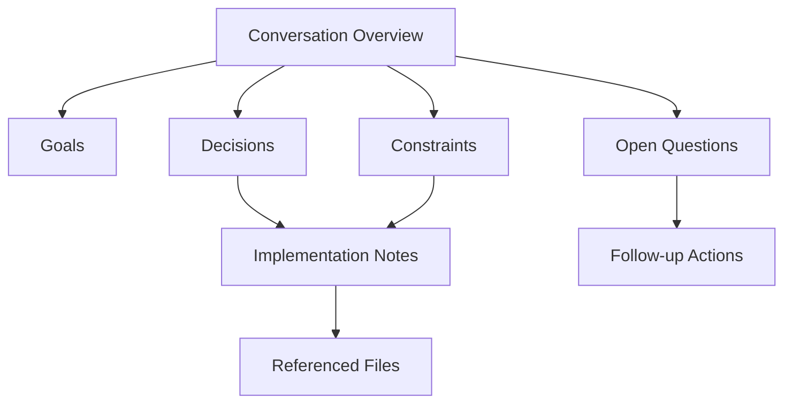
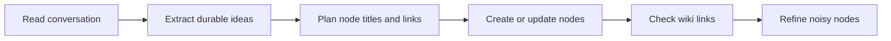
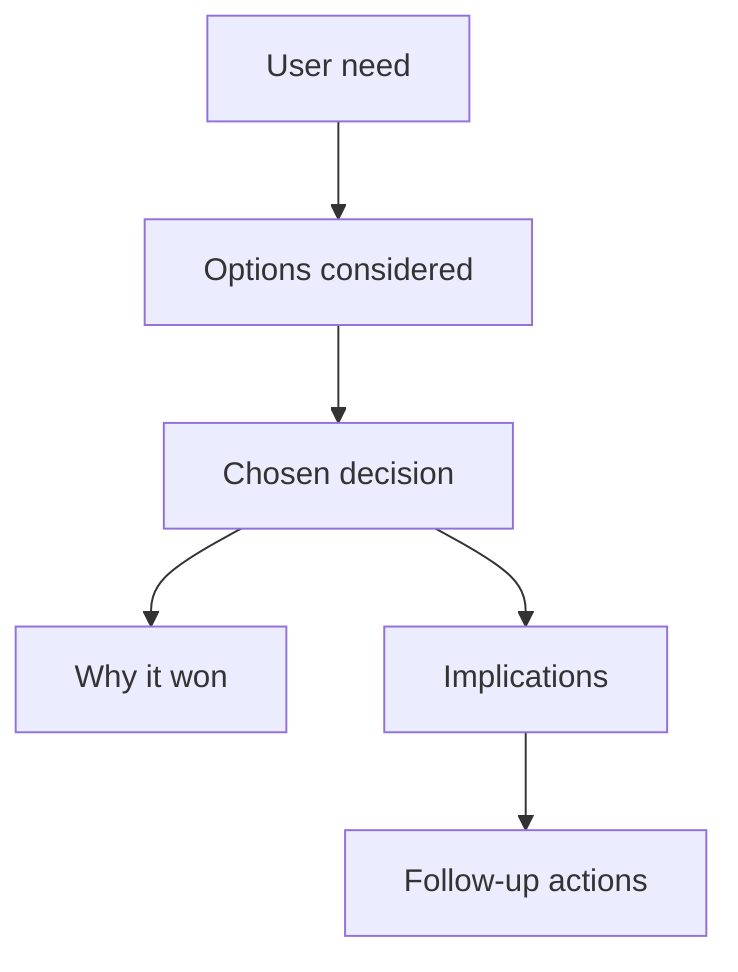

# Conversation Node Summarizer

Convert conversation history into a useful node graph: many small, linked Markdown files in `nodes/`, created and maintained with the repository scripts in `./scripts`.

The goal is not to make a pretty transcript. The goal is to preserve reusable understanding: what was decided, why it matters, what constraints shaped it, what actions remain, and how concepts connect.

## Repository Tools

Use these scripts from the repository root:

| Purpose | Script | npm alias |
| --- | --- | --- |
| Add a new node | `./scripts/add-node.sh` | `npm run node:add --` |
| Replace a node body while preserving its title | `./scripts/edit-node-content.sh` | `npm run node:edit --` |
| Read a node | `./scripts/get-node-content.sh` | `npm run node:get --` |
| Search titles | `./scripts/search-nodes-by-title.sh` | `npm run node:search:title --` |
| Search bodies | `./scripts/search-nodes-by-content.sh` | `npm run node:search:content --` |
| Verify `[[Wiki Links]]` resolve | `./scripts/check-node-links.sh` | `npm run node:check-links` |

## Node Graph Shape

Prefer a hub-and-spoke map with cross-links. Start with one overview node, then create focused nodes for decisions, constraints, actions, artifacts, people, risks, and open questions.



Good node graphs feel browsable. A reader should be able to start anywhere, follow links, and understand the important context without reading the full conversation.

## Project Identity

Always preserve the project identity when one can be inferred. Use the clearest project, product, repository, directory, or branch name that anchors the conversation.

- Look for an explicit project name in the conversation first.
- If none is explicit, infer it from the working directory name, repository name, package name, or remote URL.
- Search for an existing main node for the project or workstream, such as the primary node about `Agentgraph`, and link new nodes to it when it exists.
- If there is no main project node and the conversation establishes durable project-level context, create one and link the new nodes back to it.
- If the branch name adds useful context, include it as the workstream or feature context, such as `Agentgraph Skill Updates` from an `agentgraph` repo on a `skill-node-granularity` branch.
- The branch name can be specified in node content when it clarifies the workstream, feature, or reason the conversation happened.
- Include the project name in the overview node description and in any generic titles or opening sentences where otherwise the node would be ambiguous.
- Do not invent a project name when there is no reliable signal; use a descriptive workstream phrase instead.

## Node Granularity

Create many nodes, but avoid atomizing into noise.

- One node per durable idea: a decision, requirement, concept, risk, workflow, or action set.
- Use 6-20 nodes for a substantial conversation; fewer for short chats, more for long transcripts.
- Keep each node body as detailed as the durable knowledge requires, including code snippets, diagrams, sources, paths, commands, or evidence when they help future readers understand or reproduce the point.
- Link to 2-6 related nodes where helpful.
- Do not create nodes for pleasantries, status chatter, terminal noise, or generic tool confirmations.
- Keep a single feature as a single node unless the conversation introduces separate architectural decisions or cross-cutting constraints.
- Create new nodes only for important durable knowledge, especially architectural changes, behavioral contracts, decisions, constraints, risks, and follow-up actions.
- Avoid splitting one feature into implementation-detail nodes for UI, API, tests, config, or files unless one of those details changes the architecture or future behavior.

### Existing Node Maintenance

Treat the node graph as living documentation, not an append-only transcript. When the conversation revises, refines, renames, or restyles an artifact that an existing node already explains, update the existing node so readers see the current truth in one place.

- Search for existing nodes about the same project, artifact, feature, behavior, or visual identity before creating a replacement.
- Edit the existing node so it reflects the current state and no longer teaches stale facts.
- Prefer updating the main artifact/feature node when a later user request modifies the same artifact, such as changing a prototype's theme, copy, layout, dependencies, or file location.
- Create a separate decision/rationale node only when the reason for the change is durable future knowledge; do not create a new node merely to record that a small refinement happened.
- Link the updated node to the rationale node when a rationale node is useful, and link the rationale node back to the affected node.
- Do not create both old-state and new-state nodes unless the historical contrast is itself important future knowledge.

Good granularity:

```markdown
# Agentgraph Conversation Node Summarizer Feature Granularity

The Agentgraph summarizer treats a single user-facing feature as one durable node unless a separate architectural decision needs its own rationale.

- "Export selected nodes" stays one feature node even if the implementation touched routing, commands, and tests.
- A separate node is appropriate only if the export feature introduces a new graph serialization contract that future work must preserve.

This connects to [[Agentgraph Export Serialization Decision]] when readers need the architectural reason.
```

Behavior update example:

```markdown
# Agentgraph Node Link Validation Behavior

Agentgraph node link validation now treats unresolved wiki links as graph-quality errors that must be fixed before summarization work is complete.

This behavior changed because [[Agentgraph Link Validation Rationale]] found that unresolved links made generated node graphs hard to browse and easy to misinterpret.
```

```markdown
# Agentgraph Link Validation Rationale

Agentgraph link validation became mandatory because broken `[[Wiki Links]]` remove the navigation value of the node graph.

- The previous behavior allowed summaries to finish with missing targets.
- The new behavior requires creating the target node or revising the link to an existing title.

This explains the current behavior in [[Agentgraph Node Link Validation Behavior]].
```

Artifact refinement example:

```markdown
# SignalOps B2B SaaS Prototype

SignalOps is a Vite + React B2B SaaS landing-page prototype in `/tmp/b2b-saas`.

- The product concept is an operations command center for revenue, risk, and customer teams.
- The current visual direction uses deep rose, magenta CTA colors, blush surfaces, and pink atmospheric gradients.
- The page includes responsive landing, metrics, platform cards, workflow, and pricing sections.
```

This is better than leaving an older node that says the prototype is navy/blue and creating a second node that says the theme is pink. A reader should not have to reconcile contradictory current-state nodes.

Detailed source-backed node example:

````markdown
# Agentgraph Remotion Preview Export

Agentgraph added a Remotion-based preview export on branch `feature/remotion-preview-export`, with implementation tracked in GitHub PR #42.

- Technologies added: `remotion`, `@remotion/renderer`, and a Vite route that renders selected graph nodes into a shareable video preview.
- External sources checked: Remotion composition docs (`https://www.remotion.dev/docs/composition`) for frame sizing and Remotion rendering docs (`https://www.remotion.dev/docs/renderer/render-media`) for server-side export constraints.
- The feature stays one node because the UI, route, and test changes all serve the same preview-export behavior; [[Agentgraph Remotion Rendering Decision]] explains the architectural choice to render through Remotion instead of custom canvas capture.

Key implementation shape:

```tsx
export const PreviewComposition = ({ nodes }: { nodes: GraphNode[] }) => (
  <AbsoluteFill className="preview-export">
    <NodeTimeline nodes={nodes} />
  </AbsoluteFill>
);
```

The PR discussion matters because it records why browser-only capture was rejected: it produced inconsistent fonts and layout timing across machines.
````

Poor granularity:

```markdown
# Export Button Component
# Export Route Handler
# Export Test Command

These nodes describe pieces of one feature without preserving a separate durable decision or architectural contract.
```

## Conversation Extraction Pass

Read the conversation and classify information into buckets before writing files:

| Bucket | What to capture | Example node title |
| --- | --- | --- |
| Overview | What the conversation accomplished | `Conversation Summary - Node Skill` |
| Goals | Desired outcome and success criteria | `Conversation Node Skill Goals` |
| Decisions | Chosen direction and rationale | `Node Summarization Decisions` |
| Constraints | Boundaries, preferences, non-goals | `Concise Agent Communication` |
| Workflow | Repeatable process | `Conversation To Node Workflow` |
| Artifacts | Files, scripts, commands, outputs | `Node Script Usage` |
| Actions | Follow-ups with owners or triggers | `Conversation Follow-up Actions` |
| Questions | Unknowns or deferred choices | `Open Questions From Conversation` |

When the conversation includes code, commands, paths, URLs, or diagrams, preserve them only when they help future work. Summarize logs; do not paste long output unless the exact output is important evidence.

## Writing Style For Nodes

Use direct, information-dense prose.

- Start with the point, not a meta sentence like "This node summarizes...".
- Prefer bullets for decisions, requirements, and actions.
- Keep titles stable and linkable: Title Case, no dates unless the node is event-specific.
- Titles must be unique. Include the project, product, customer, or workstream name when a generic title would collide, such as `Atlas Sync Decisions` instead of `Decisions`.
- If a project name is known, include it in the overview node's opening description and in generic behavior, decision, and feature node titles.
- Use `[[Exact Node Title]]` links. Link titles must match node headings.
- Prefer links embedded in natural sentences over a trailing `Related:` line.
- Include source hints only when useful: file paths, command names, issue IDs, URLs, or timestamps.
- Avoid filler inside node bodies: no "sent to phone", "verified with linting", "build passed", "all set", "as requested", "successfully completed", or similar status phrases unless that operational event is the actual subject of the node.

## Node Noise Filter

The generated nodes are the output. Optimize the node content, not a final chat response.

- Exclude execution trivia that does not teach the future reader anything.
- Exclude tool-delivery notes such as phone notifications, screenshots sent, browser opened, or files handed off.
- Exclude verification boilerplate such as lint/build/test status unless the user asked to preserve the verification result or the conversation is specifically about diagnosing that verification. Assistant final-message lines like "Verified with `bun run build`; build passed" are delivery status, not durable node content.
- Exclude generic assistant self-reporting such as "I created", "I updated", "done", or "as requested".
- Keep operational facts only when they change the knowledge graph: a failed command that caused a decision, a broken link that created an action, or a test result that is evidence for a technical claim.

Good node content:

```markdown
The node graph should preserve durable decisions and constraints from the conversation.

- Capture goals, decisions, actions, artifacts, and open questions as separate linked nodes.
- The [[Conversation To Node Workflow]] uses `./scripts/check-node-links.sh` because unresolved links make the graph harder to browse.
```

Poor node content:

```markdown
The assistant created the nodes successfully, verified with linting, sent the result to the phone, and completed the request.
```

## Script Workflow

1. Identify the project name from the conversation, directory, repo, package, remote, or branch when available.
2. Search before creating, to avoid duplicates, find the main project/workstream node to link to, and find stale nodes that should be updated.
3. If the conversation modifies an artifact already represented by a node, read that node and plan the edit before adding any new node.
4. Create or update nodes with the repository scripts rather than writing ad hoc files.
5. When behavior changes, update the existing behavior node and create or update a linked rationale node only when the rationale is durable future knowledge.
6. Run `check-node-links.sh` after changing linked nodes.
7. If a link is missing, create the target node or revise the link to an existing title.

### Search For Existing Nodes

```bash
./scripts/search-nodes-by-title.sh "Conversation"
./scripts/search-nodes-by-content.sh -C 5 "node graph"
```

### Verify Links

```bash
./scripts/check-node-links.sh
```

If it reports `Missing link: Source -> Target`, either create `Target` exactly or change the link to an existing title.

## Node Content Template

Use this template for most nodes:

```markdown
# Node Title

One-sentence point of the node.

- Important fact, decision, or constraint.
- Supporting detail with a source path, command, or linked concept if useful.
- Follow-up action or implication.

This connects to [[Other Node]] when readers need the broader context and to [[Another Node]] when they need the implementation details.
```

For an overview node:

```markdown
# Conversation Summary - Short Topic

The conversation centered on [goal/outcome], with emphasis on [constraints] and [artifacts].

## Main Threads

- [[Goal Node]] - why the work exists.
- [[Decision Node]] - what was decided and why.
- [[Workflow Node]] - how future agents should repeat the work.
- [[Open Questions Node]] - what remains unresolved.

## Useful Artifacts

- The scripts in `./scripts/` manage node files and verify wiki links.
- `./src/data/nodeGraph.ts` shows how titles and `[[Wiki Links]]` become graph connections.
```

## Diagram Patterns

Use Mermaid diagrams only when they clarify structure. The app renders Mermaid blocks in the node panel.

### Workflow Diagram



### Decision Map



## Quality Checklist

Before responding, check the graph against this list:

- The overview node links to every major node.
- The overview description names the project or workstream when one can be inferred.
- New nodes link to the main project or workstream node when one exists or was created.
- Every `[[Wiki Link]]` points to an existing node title.
- Each node captures one durable idea, not a transcript slice.
- A single feature remains a single node unless an architectural decision needs a separate node.
- Existing behavior nodes are updated when behavior changes, with a linked rationale node explaining why.
- Existing artifact or feature nodes are updated when later turns revise the same artifact, so current-state facts are centralized instead of contradicted by newer nodes.
- Repeated facts are centralized in one node and linked from others.
- Node bodies omit irrelevant status claims, delivery notes, build/test boilerplate, and assistant self-reporting.

## Edge Cases

- If the conversation is tiny, create only the nodes that add future value.
- If the user wants exhaustive coverage, make more nodes but still keep each node meaningful.
- If existing nodes overlap with the conversation, update them instead of creating duplicates.
- If title conflicts exist, prefer clearer titles over numbered variants.
- If the transcript includes sensitive data, summarize the operational point without copying secrets.
