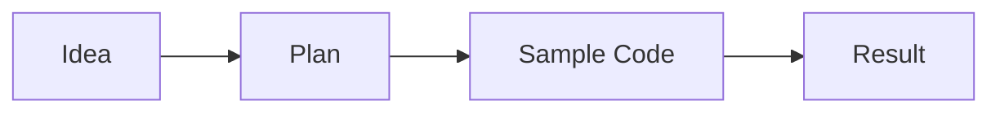

# Mermaid Diagram and Sample Code

A small pattern node that pairs a Mermaid flowchart with a code example.



```js
function greet(name) {
  return `Hello, ${name}!`;
}

console.log(greet('world'));
```

Use this shape when you want a compact node that shows both structure and implementation in one place, similar to how [[Node Panel Markdown Rendering]] treats Mermaid and code fences as first-class content.

This belongs to [[AgentGraph Project Overview]] as part of the AgentGraph project knowledge graph.
