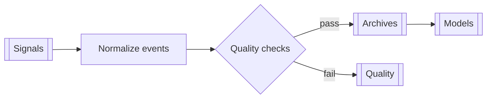

# Pipelines

Pipelines normalize raw [[Signals]], schedule jobs, publish durable datasets into [[Archives]], and feed checks owned by [[Quality]].

```mermaid
flowchart LR
  Signals[[Signals]] --> Normalize[Normalize events]
  Normalize --> Validate{Quality checks}
  Validate -->|pass| Archives[[Archives]]
  Validate -->|fail| Quality[[Quality]]
  Archives --> Models[[Models]]
```
